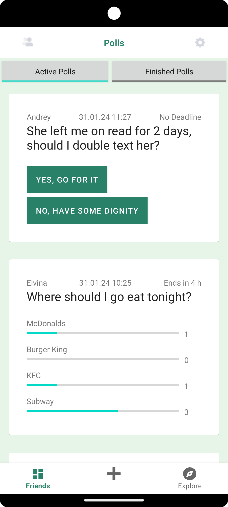
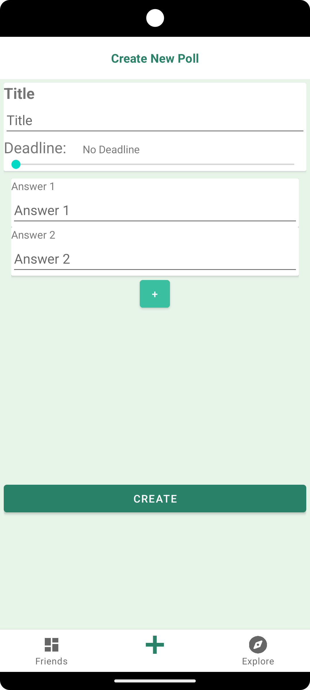

# XPoll - Connect Your Choices

## Team Members
- Patrick Barclay
- Elvina Fahlgren
- Ingvild Hauge
- Andrey Nosov

## About XPoll
XPoll is an app that connects people through polls, allowing them to share opinions on various topics with friends and the community. It encourages active participation in decision-making in a fun and simple way.

## Tagline
"Share, Decide, Unite! - Make your voice heard with XPoll."

## Screenshots

  

## Permissions Required
XPoll requires no extra permissions from the user.

## Data Safety
Your privacy is important. XPoll collects minimal data, uses it to improve the app, and does not share it without consent.
